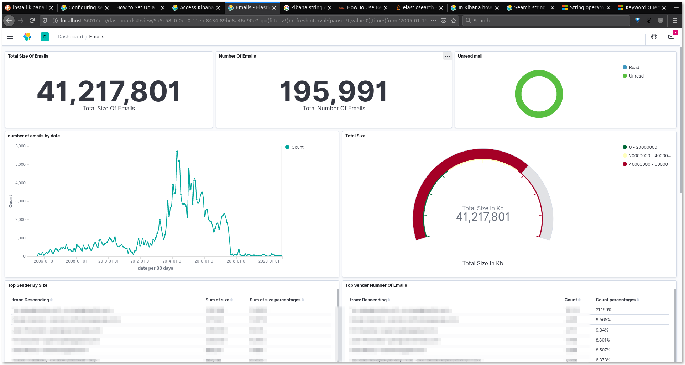

# Green Imap Tool (GreenIT)

Understand your emails and take actions

Compatible with all email providers (use Imap protocol)



## Road map

### v1

A cli tool to vizualize your mailbox

Use cases

* list top email addresses to ban: high % of unread messages + high number of messages
* same for subjects/discussions to delete

Features

* [x] Load all emails
* [x] Group emails by to, from, subject similarity
* [x] Visualize in kibana
* [ ] A clean CLI app to load ES and IMAP settings and import emails
* [ ] Deploy on npm

Bonus: compare email providers speed

* [ ] Gandi
* [ ] OVH
* [x] Fastmail - 20K msg/min
* [ ] Gmail
* [ ] Yahoo

### v2

A web app and electron app to vizualize and take actions on your mailbox

* [ ] Filter by status - seen, flagged, not from me
* [ ] Visualize and take action in the same UI
* [ ] Batch delete, flag, move
* [ ] Automatic install of ES
* [ ] Deploy as an electron app

## Installation

1. [Install and start elastic search](https://www.elastic.co/guide/en/elasticsearch/reference/current/getting-started-install.html#run-elasticsearch-local) and [install and start Kibana](https://www.elastic.co/guide/en/kibana/current/install.html#_install_kibana_yourself)
2. `npm install -g greenit`

## Usage

Setup the connection to your email account (IMAP) and to elasticsearch

> Note: [here are instructions to enable IMAP on gmail](https://support.google.com/mail/answer/7126229?hl=en)

```
$ greenit init
This utility will setup greenit. It will ask you sensitive information which will not be sent anywhere. If you choose "remember password" it will be stored in plain text in a file named ".env". Please check the source code.
[email setup 1/4] user: your.email@gmail.com
[email setup 2/4] password: *******
[email setyp 3/4] host: imap.gmail.com
[email setyp 4/4] remember password (yes):
[elasticsearch setup 1/2] URL (http://localhost:9200): 
[elasticsearch setup 2/2] Index name (emails):
Saving data in .env...
Success
```

Check installation and configuration

```
$ greenit -v
1.0.0
$ greenit check
Testing email connection (IMAP)...
Ok
Testing elastic search connection...
Ok
```

Import your emails

```
$ greenit import email
Importing...
...
Succes: 500932 emails imported in 23 min
```

You can the visualize your emails in kibana

1. open http://localhost:5601/ in a browser
2. setup index pattern: 
